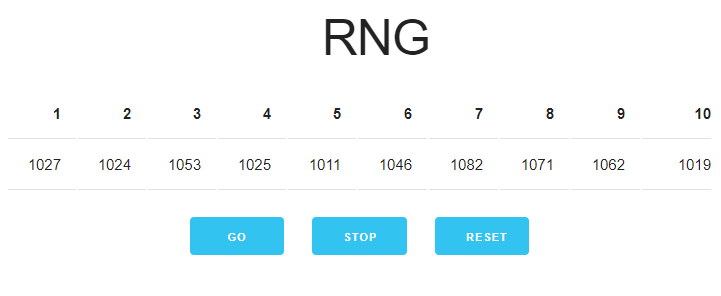

# RNG

Click the button and watch the random numbers be generated!

## Preview

## Why?

In [this](https://old.reddit.com/r/software/comments/jhy24l/rng_software/) Reddit thread, [u/hutson](https://old.reddit.com/u/hutson) posted:

> I am looking for an RNG program that will randomly select a number between 1 and 10 for hundreds of times a second for as long as I want. When I tell it to stop I want the result to be the frequency of each number's appearance. I am wanting to run some experiments on the claim that the human brain can influence the results of an RNG. Does anyone know any software like this? It will have to run native, not web-based. Thanks!